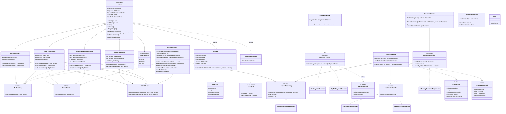

# Banking system — class diagram

Rendered with any Mermaid-compatible viewer (GitHub, GitLab, VS Code Mermaid
preview extension, IntelliJ Mermaid plugin, mermaid.live, etc).

```mermaid
classDiagram
    class Account {
        <<abstract>>
        -String accountNumber
        #BigDecimal Balance
        -AccountStatus accountStatus
        -Customer Owner
        -LocalDate CreationDate
        +deposit(amount)
        +withdraw(amount)
        +freeze()
        +unfreeze()
        +chargeFee(fee)
        +applyInterest(interest)
        +getAvailableBalance() BigDecimal
        #doDeposit(amount)*
        #doWithdraw(amount)*
    }

    class CurrentAccount {
        -BigDecimal overdraftLimit
        -LimitPolicy limitPolicy
        +calculateFee(amount) BigDecimal
        +getAvailableBalance() BigDecimal
    }

    class SavingsAccount {
        -BigDecimal interestRate
        -BigDecimal minimumBalance
        -LimitPolicy limitPolicy
        +calculateInterest() BigDecimal
        +getAvailableBalance() BigDecimal
    }

    class CreditCardAccount {
        -BigDecimal creditLimit
        -BigDecimal interestRate
        -LimitPolicy limitPolicy
        +calculateFee(amount) BigDecimal
        +calculateInterest() BigDecimal
        +getAmountOwed() BigDecimal
    }

    class PremiumSavingsAccount {
        -BigDecimal interestRate
        -BigDecimal minimumBalance
        -LimitPolicy limitPolicy
        -int withdrawalsThisMonth
        +calculateFee(amount) BigDecimal
        +calculateInterest() BigDecimal
    }

    class FeeBearing {
        <<interface>>
        +calculateFee(amount) BigDecimal
    }

    class IntrestBearing {
        <<interface>>
        +calculateInterest() BigDecimal
    }

    class LimitPolicy {
        +remainingLimit(currentValue, floor) BigDecimal
        +canDebit(currentValue, amount, floor) boolean
    }

    class AccountStatus {
        <<enumeration>>
        ACTIVE
        FROZEN
        CLOSED
    }

    class Customer {
        -String customerId
        -String fullName
        -String nationalId
        -String mobileNumber
        -Address address
        +updateContactDetails(fullName, nationalId, mobile, address)
    }

    class Address {
        -String street
        -String city
        -String governorate
        -String postalCode
    }

    class BankingException {
        -ErrorCode errorCode
    }

    class ErrorCode {
        <<enumeration>>
        +condition() String
        +defaultMessage() String
    }

    class NotificationSender {
        <<interface>>
        +send(customer, message)
    }
    class SmsNotificationSender
    class EmailNotificationSender

    class PaymentProvider {
        <<interface>>
        +processPayment(account, amount) PaymentResult
    }
    class VisaPaymentProvider
    class PayPalPaymentProvider
    class PaymentResult {
        <<record>>
        +boolean success
        +String providerReference
        +String message
    }

    class AccountRepository {
        <<interface>>
        +findByAccountNumber(accountNumber) Account
        +save(account)
        +findAll() List
    }
    class InMemoryAccountRepository

    class CustomerRepository {
        <<interface>>
        +findById(customerId) Customer
        +Save(customer)
        +existsByNationalId(nationalId) boolean
    }
    class InMemoryCustomerRepository

    class CustomerService {
        -CustomerRepository customerRepository
        +CreateCustomer(fullName, nationalId, mobile, address) Customer
        +getCustomer(nationalId) Customer
        +updateContactDetails(...) Customer
    }

    class PaymentService {
        -PaymentProvider paymentProvider
        +charge(account, amount) PaymentResult
    }

    class AccountService {
        -AccountRepository accountRepository
        -LimitPolicy limitPolicy
        -List~FeeBearing~ monthlyFeeAccounts
        -List~IntrestBearing~ interestBearingAccounts
        +openAccount(customer, type) Account
        +checkBalance(accountNumber) BigDecimal
        +freezeAccount(accountNumber)
        +unfreezeAccount(accountNumber)
        +runMonthlyFees()
        +runMonthlyInterest()
    }

    class TransferService {
        -AccountRepository accountRepository
        -NotificationSender notificationSender
        +transfer(from, to, amount) TransactionResult
    }

    class Transaction {
        <<record>>
        +String transactionId
        +String fromAccountNumber
        +String toAccountNumber
        +BigDecimal amount
        +LocalDateTime timestamp
    }

    class TransactionResult {
        <<record>>
        +boolean success
        +String message
        +String transactionId
        +BigDecimal amount
    }

    class TransactionHistory {
        -List~Transaction~ transactions
        +record(transaction)
        +getTransactions() List
    }

    class Main {
        +main(args)$
    }

    Account <|-- CurrentAccount
    Account <|-- SavingsAccount
    Account <|-- CreditCardAccount
    Account <|-- PremiumSavingsAccount
    Account "1" --> "1" Customer : owner
    Account --> AccountStatus
    Account ..> BankingException : throws
    BankingException --> ErrorCode

    CurrentAccount ..|> FeeBearing
    SavingsAccount ..|> IntrestBearing
    CreditCardAccount ..|> FeeBearing
    CreditCardAccount ..|> IntrestBearing
    PremiumSavingsAccount ..|> FeeBearing
    PremiumSavingsAccount ..|> IntrestBearing

    CurrentAccount --> LimitPolicy
    SavingsAccount --> LimitPolicy
    CreditCardAccount --> LimitPolicy
    PremiumSavingsAccount --> LimitPolicy

    Customer --> Address

    NotificationSender <|.. SmsNotificationSender
    NotificationSender <|.. EmailNotificationSender

    PaymentProvider <|.. VisaPaymentProvider
    PaymentProvider <|.. PayPalPaymentProvider
    PaymentProvider ..> PaymentResult : returns

    AccountRepository <|.. InMemoryAccountRepository
    CustomerRepository <|.. InMemoryCustomerRepository

    CustomerService --> CustomerRepository
    PaymentService --> PaymentProvider
    AccountService --> AccountRepository
    AccountService --> LimitPolicy
    AccountService ..> FeeBearing
    AccountService ..> IntrestBearing
    TransferService --> AccountRepository
    TransferService --> NotificationSender
    TransferService ..> Transaction
    TransferService ..> TransactionResult
```